# Okta Authentication in Node.js for Face Recognition App
A user can login to your application using their okta account.  
The app would tell you the number people sitting in front of the screen.  
Once you logout of the app, you would have to log in again to use the app.  

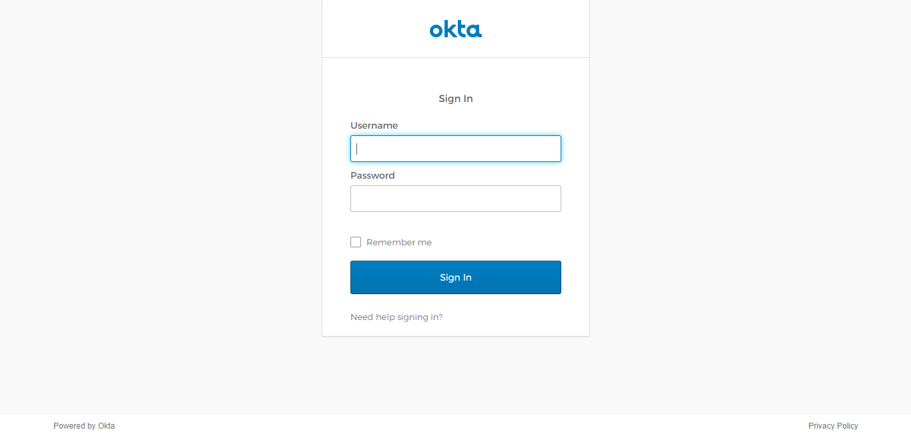

## Folder structure
Create 3 folders-  
-*public* : Stores the main app.js file      
-*views*  : Stores the html & css files      
-*server* : Stores the index.js file      
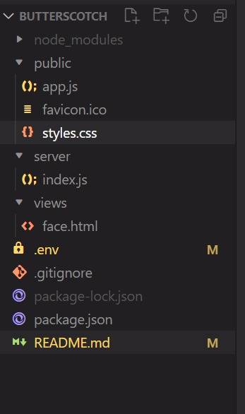  

## Packages you need to install for this module

| Packages              | Version |  
| ----------------------|:-------:| 
| @okta/oidc-middleware | 4.0.3   | 
| axios                 | 0.21.1  |  
| cookie-parser         | 1.4.5   |  
| dotenv                | 8.2.0   |
| ejs                   | 3.1.6   |
| express               | 4.17.1  |
| express session       | 1.17.1  |
| nodemon               | 2.0.7   |

## Table of Contents
**Components**  

  - [Okta OIDC](#1-okta-oidc)    
  - [Axios](#2-axios)  
  - [Cookie Parser](#3-cookie-parser)  
  - [DOTENV](#4-dotenv)  
  - [EJS](#5-ejs)     
  - [Express](#6-express)  
  - [Express Session](#7-express-session)  

**Steps to create an app on okta**

## Components
We are gonna look into all the components (packages) used for the application.

## 1) Okta OIDC
[Okta](https://github.com/okta/okta-oidc-js) is an Identity-as-a-Service (IDaas)  platform that allows people under an organisation to access software with a single login. Okta offers a cloud based flexible directory. This enables an organisation to give access to employees within the organisation to certain applications.

`npm i @okta/oidc-middleware`

This package helps make it easier for users to log in with Okta using OpenID Connect (OIDC). It enables the Express application to participate in the authorization codeflow by redirecting the user to Okta for authentication and handling the callback from Okta. Once the authentication is done, a local session is created and the user context is saved during the session.

Create an instance of the okta middleware by passing the following details in a dict object:

- **issuer** - The OIDC provider (e.g. https://{yourOktaDomain}/oauth2/default)

- **client_id** - An id provided when you create an OIDC app in your Okta Org (This is loaded from the .env file)

- **client_secret** - A secret provided when you create an OIDC app in your Okta Org (This is loaded from the .env file)

- **appBaseUrl** - The base scheme, host, and port (if not 80/443) of your app, not including any path (e.g. http://localhost:8080, not http://localhost:8080/ )

- **scope** - the scope required is openid

- **routes** - This object is used to define the custom routes we will be using for the app. The default values for the routes are:  
-- for login - '/login'  
-- for callback - '/authorization-code/callback'  
-- for logout - '/logout' you should send a POST request to this using requests/axios not a GET request and okta will destroy the session on their server, as for the local session it should be destroyed using req.logout()   

 ## 2) [Axios](https://github.com/axios/axios)
Axios is a promise based HTTP client that consists of an easy-to-use API and can be used by both the browser and Node,js.

`npm i axios`

Making HTTP requests to fetch or save data is one of the most common tasks a client side JS application would need to do. Axios enables that with popular libraries in the Node.Js ecosystem.

## 3) [Cookie Parser](https://github.com/expressjs/cookie-parser#readme)

Cookies are simple, small files/data that are sent to client with a server request and stored on the client side. Every time the user loads the site, the cookie is sent with the request. The cookie helps keep track of the users actions. 
To use Cookies with Express, we need the cookie-parser middleware.

`npm i cookie-parser`

**cookie-parser** is a middleware which parses cookies attached to the client request object. To use it, we require it in the index,js file. This can be used the same way as use other middleware like the okta/oidc middleware.

## 4) [DOTENV](https://github.com/motdotla/dotenv#readme)

Dotenv is a zero-dependency module that loads environment variables from the environment file into process.env. 
Environment variables allow us to manage the configurations of our applications separately from our codebase. Separating configs make it easier for our application to be deployed in different environments.

`npm i dotenv`

Configuration data stored in environment variables are: 
- HTTP Port 
- Endpoint of external services

## 5) [EJS](https://ejs.co/#:~:text=EJS%20is%20a%20simple%20templating,about%20how%20to%20organize%20things.)

EJS is a templating language that lets you generate HTML markup with plain JS. We define HTML pages in the EJS syntax and we specify where various data will go in the page. The app then combines the data with the template and renders a complete HTML page where EJS takes your data and inserts it into the web page according to how you've defined the template.

`npm i ejs`

## 6) [Express](http://expressjs.com/)

Express is a web application framework that provides a simple API to build websites, web apps and backends. Express provides a minimal interface to build our applications. It's absolutely flexible and consists of multiple plugins that can be used along with Express.

`npm i express`

## 7) [Express Session](https://github.com/expressjs/session#readme)

HTTP is stateless. So in order to associate a request to any other request we need a way to store the the user data between HTTP requests. We can use cookies for that. But it's readable on the client side, and hence we use sessions. We provide a client with an ID and it makes requests with that particular ID. 

`npm i express-session`

# Getting started
Open terminal and create a new directory  
`cd` into the new directory  
Now run `npm init`  
Or run `npm init y` without going through the interactive process  
New project will be created with node modules and a package.json file  
Install the packages  
Create the dotenv file .env & store the client id, secret and okta domain url  

# Create an App on Okta

## Step 1:
Sign up on (https://developer.okta.com) & log in to your okta account. 
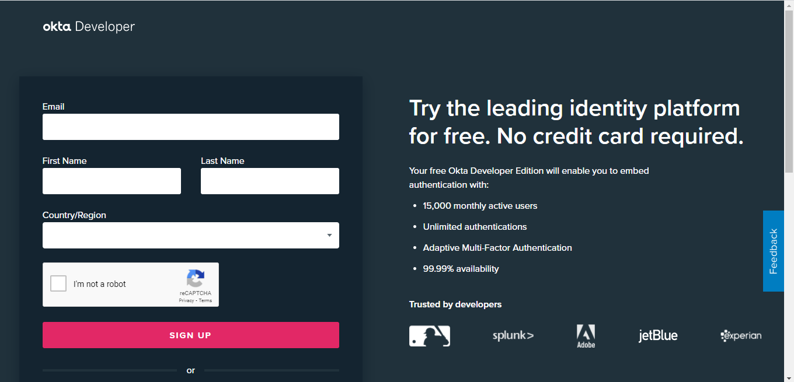

## Step 2:
Click on `Applications` tab on the menu. Click on `Applications` again from the drop down menu. 
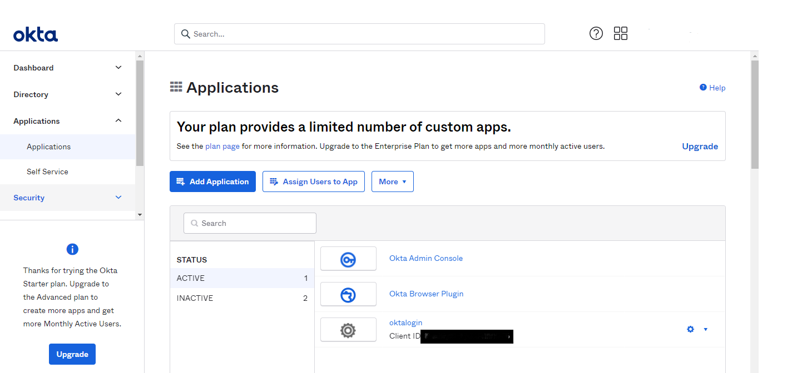

Click on `Add Aplication` 
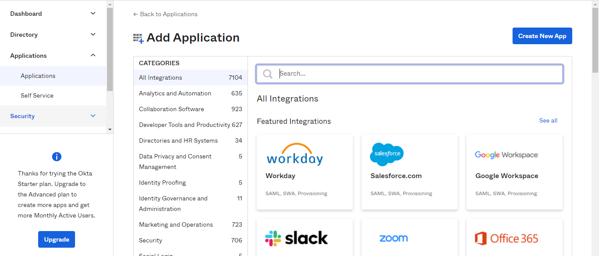

## Step 3: 
Click on `Create New App` 

`Create a New Application Integration` dialog box shows up, select `Web` option under Platform and select `OpenID Connect` under SignOn Method and click on create. 
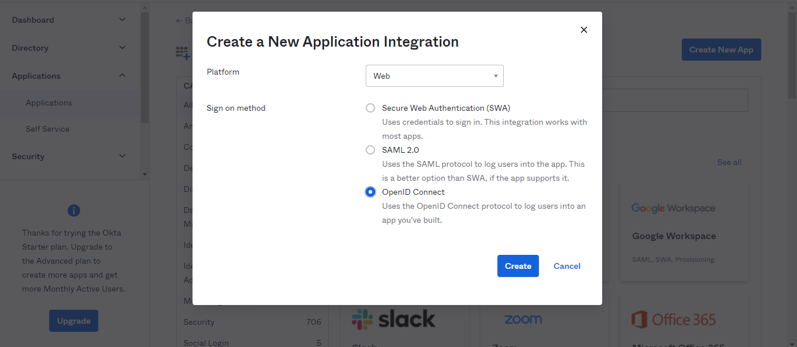

## Step 4:
Here you configure your App settings. 
Give a name to your application. 
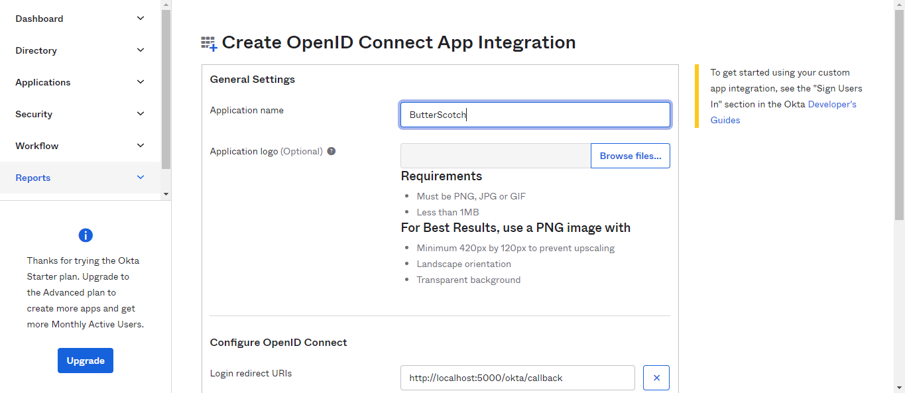

Under OpenID Connect, Add your `Login redirect Uri & your Logout redirect Uri`, then click on Save. 
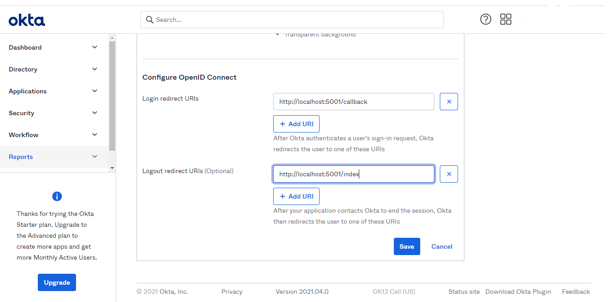

## Step 5:
Your Application settings open up, save the `Client ID,Client Secret & okta domain` in your dotenv file. 
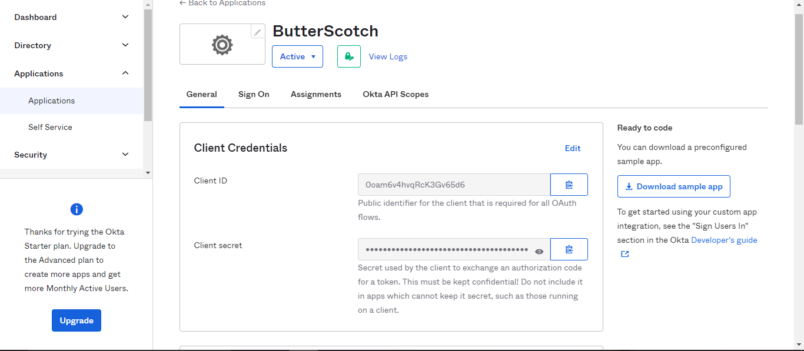

## Step 6:
Click on `Assign` -> `Assign people` -> Assign yourself to the application -> check if your details are right -> click on `save and go back` 
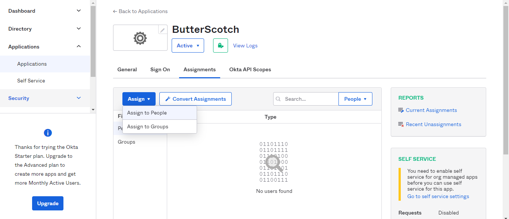
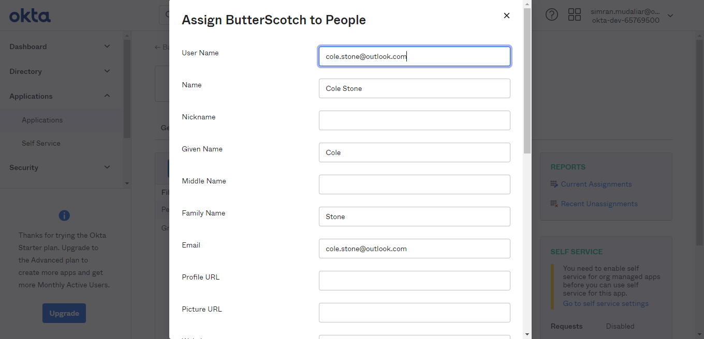
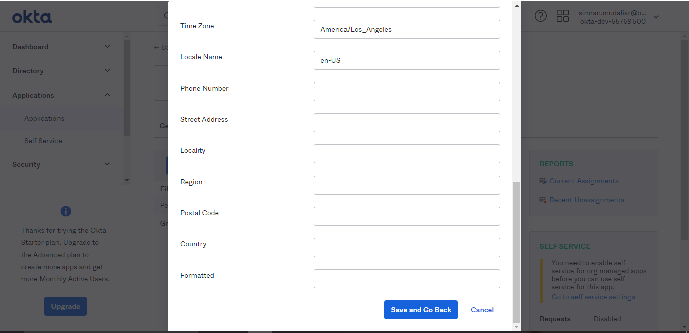

## Done
Now you have access to the application you just created.  

## Authors and Acknowledgment  
[@Simrankumaran](https://github.com/Simrankumaran)   [@vgnsh333](https://github.com/vgnsh333)   [@Vcuber](https://github.com/Vcuber)   created this module with the guidance of [@rathishkumar](https://github.com/rathishkumar).
